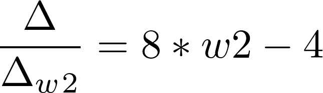

# 介绍

这是我的毕业设计题目：基于人脸图像进行年龄预测。 

其原理是基于机器学习（machine learning），具体原理请见本文最后 - 原理介绍

如果你也想训练自己的神经网络，或者也想学习机器学习，教程推荐：[todo]

 

# 数据集、机器学习框架、web框架等

1.数据集使用的是IMDB-WIKI数据集：https://data.vision.ee.ethz.ch/cvl/rrothe/imdb-wiki/

@article{Rothe-IJCV-2016,
  author = {Rasmus Rothe and Radu Timofte and Luc Van Gool},
  title = {Deep expectation of real and apparent age from a single image without facial landmarks},
  journal = {International Journal of Computer Vision (IJCV)},
  year = {2016},
  month = {July},
}

2.机器学习框架使用的是TensorFlow

3.web框架使用的是django

4.训练使用的google colab

# 使用本项目

0.首先使用pip install 安装几个包(吐槽一下，python没有类似于前端的package.json之类的文件直接记录依赖包关系吗):tensorflow、scipy(用于读取mat文件)、django（用于搭建http服务器） 

1.首先由于数据集太大，肯定不能放在gtihub上面，去上面的链接下也会很慢，我专门将其上传到微云给大家下载。由于IMDB-WIKI一共有两部分数据 IMDB和WIKI部分，我的论文仅研究使用，故只下载并上传了较小的wiki部分（700MB左右）

2.下载好后应该把 **wiki_crop**(图片) 和 **wiki.mat**（图片信息） 两个文件应该如图放置

│  README.md　　　　　　　　　 
│  save_to_tfrecord.py　　　　　　　　　 
│  tfrecord_eval　　　 
│  ............　　　　　　 
│  **wiki_crop**　　　 
&nbsp;&nbsp;&nbsp;&nbsp;&nbsp;│ 00      
&nbsp;&nbsp;&nbsp;&nbsp;&nbsp;&nbsp;&nbsp;&nbsp;&nbsp;&nbsp;│   23300_1962-06-19_2011.jpg    
|  **wiki.mat**　　　 
　　　　　　　　　

3.然后就是你的表演时间了，主要是四个文件，这里只做简单的介绍，代码注释很完善，欢迎阅读指正， 

· *config.py*文件：主要是配置，包括了需要读取多少个文件，生成的文件名等信息。

· *svae_to_tfrecord.py*文件（间接引用mat.py文件）：用于将图片数据和年龄数据处理到一起。并保存为tfrecord文件，因为歪果仁之前做的是图片和分离的mat文件，两者之间通过文件名进行关联。

· *tfrecord_train.py*文件：用于读取tfrecord文件，并构建一个vgg19神经网络架构，然后进行训练。

· *tfrecord_eval.py*文件：用于评估训练好的模型误差。不用太关注这个文件。

*4.如果你不需要http服务器，不需要看这之后的步骤了 
以上步骤就可以训练好一个模型model了，接下来是搭建一个简单的django http服务器： 
./jiladahe1997_website_ml 目录下是django文件目录，所有目录结构都是django初始化生成的，所以你问我我也不知道干什么的。除了在urls.py中加一个路由，以及新建一个view.py中并且写一个控制器。

因此你只需要看一下view.py中的代码即可。

直接运行python ./jiladahe1997_website_ml/manage.py runserver 即可。

# 使用示例

图片太大了传不了 点这里 http://120.78.151.148/ml 可以看

# 踩过的坑

1.CPU训练图像30S一张，温度90度，我真的怕我的神船Z7刚不住。启用GPU：过程比较复杂，但是参照https://www.tensorflow.org/install/gpu，可以顺利完成，**务必注意CUDA 必须为10.0版本，安装了个10.1版本用不了佛了** （启用后0.7s一张图片）

# todo:

√ 1.修改metric
就用MAL

√ 2.调整batch和steps_per_epoch 
batch指一次训练的图片张数，steps_per_epoch指训练几个batch

√3.test_data

√ 4.CPU 90度刚不住，启用GPU
见上面

√(高优先度)5.现在训练20个epochs后absolute loss固定在12-13，需要优化。→ 6.修改回归输出→分段回归

√(高优先度)7.分批运行，避免显存爆炸

√ 8.训练完后保存
调用model.save

# 原理介绍

假设输出结果和输入之间存在某种关系式，例如z=w1x+w2y，其中x和y是机器学习的输入，z是机器学习的输出，w1和w2都是未知的。（假设正确的关系式是：z=x+y）

现在有n组xyz，x=1,2,3 y=1,2,3 z=2,4,6

第一步：初始化一个w1 w2，假设w1=1 w2=2, 则现在的关系式是 z=x+2y

第二步：输入x=1 y=1 z=2，那么现在得到的预测结果Zpredict = zp = 3。其离正确值3还相差1。接下来就要调整w1 w2减少这个误差。

第三部：首先误差表达式可以表示为，即问题转换为求这个函数的极小值

第四步：首先对w1求导：

再对w2求导

第五步：然后沿着两个方向分别取更小的 w1 w2值，计算新的z值（梯度下降：https://zh.wikipedia.org/zh-hk/%E6%A2%AF%E5%BA%A6%E4%B8%8B%E9%99%8D%E6%B3%95）

第六步：重复第五步，直到z的值不下降为止

第七步：找到新的w1，w2值，重新代入第二组数据重复1-7步